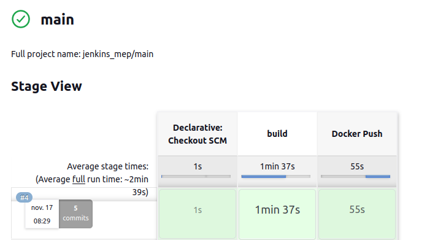
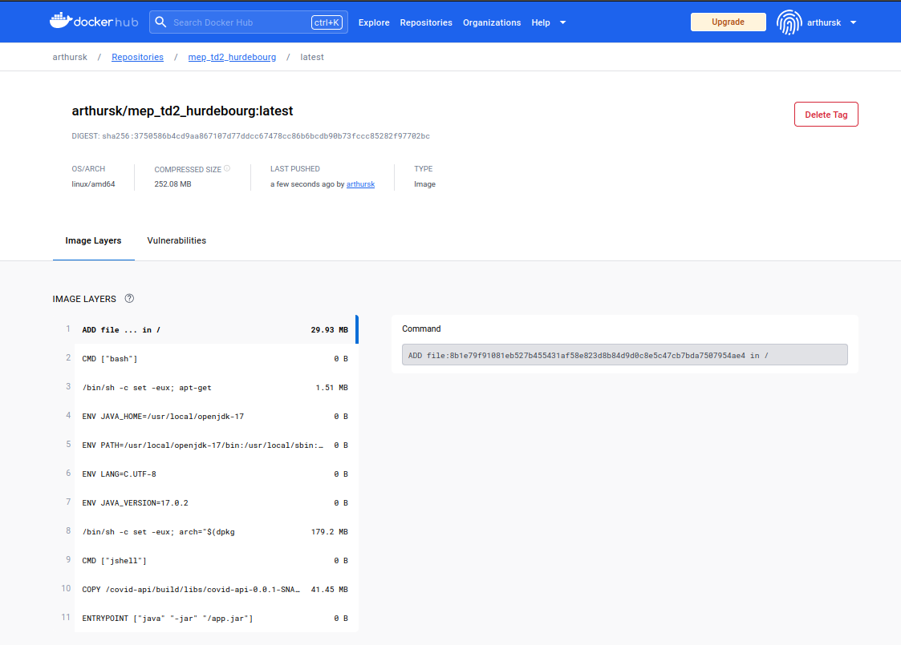

# TD2_MEP de Arthur HURDEBOURG

## Partie docker local

### Configuration intiale :
- Commencer par build le conteneur avec le fichier docker-compose :
```bash
docker compose up --build -d
```
- Ensuite on exécute le conteneur en l'ouvrant avec une interface bash :
```bash
docker compose exec -it db bash
```
### Test sur le conteneur :
- On se connecte sur la base de donnees avec le login "postgres" et le mot de passe "postgres"
```bash
psql -h localhost -p 5432 -U postgres -d postgres
```

- Inserer des données dans la base de données
```sql
INSERT INTO vaccination_center (id,address,city, name, postal_code) VALUES (1, '5 rue du poisson','Paris','Centre de Paris','75000');
INSERT INTO vaccination_center (id,address,city, name, postal_code) VALUES (2, '2 rue de Brabois','Nancy','Centre de Nancy','54000');
```
- Afficher le contenu de la base de données
```sql
SELECT * FROM vaccination_center;
```

- On peut quitter l'interface postgres avec :
```bash
\q
```
puis
```bash
exit
```
### Appel Backend
- On peut maintenant tester le backend avec notre fonction getAllCenter() :
```
GET http://localhost:8081/api/center/
```
ou
```bash
curl 'http://localhost:8081/api/center/'
```
### Pour désactiver les docker on fait :
```bash
docker compose down
```


## Partie Jenkins
### On commence par récupérer le projet Jenkins que vous nous avez fourni sur github
```bash
git clone https://github.com/jredel/jenkins-compose.git
```
On lance le conteneur en faisant ```docker compose up``` puis on peut trouver le mot de passe de Jenkins sur les logs du conteneur sur l'application Docker Desktop

Une fois le mot de passe trouvè, on peut lancer Jenkins sur son navigateur en allant à l'adresse `localhost:8001`.  
On rentre le mot de passe, puis on fait l'installation de tout ce qui est nécessaire.  
On clique sur rester en mode administrateur puis on a accès à Jenkins.  

### Il faut maintenant ajouter un credential afin d'accèder et de lier notre compte DockerHub
Dans Jenkins :
` Tableau de bord ` -> ` Administrer Jenkins ` -> ` Identifiants ` -> ` System ` -> ` Identifiants globaux (illimité) ` -> ` Add credentials `  
On ajoute comme paramètres :
- Le nom d'utilisateur sur DockerHub
- Le mot de passe de DockerHub
- Dans ID, on met : dockerHub

### Création d'une Pipeline Multibranches sur Jenkins
- Dans ` Branch Sources ` -> ` Add Source ` -> ` GitHub ` :

- Dans dans Repository HTTPS URL l'adresse du répository GitHub à cloner :
    https://github.com/ArthurSK6/TD2_MEP.git

### On peut maintenant lancer un build pour tester si tout s'effectue correctement
- On peut voir que le build s'est bien passé et s'est effectué en environ 2min30 :


- Dans docker hub après le build, j'ai dans mon repository :


### Source
https://github.com/jredel/jenkins-compose
